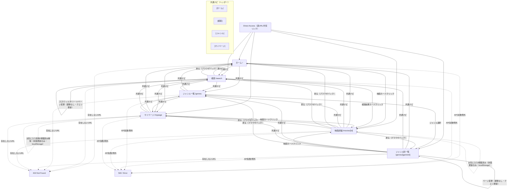

# 映画紹介アプリ - 設計ドキュメント

## 目次
1. [目的](#目的)
2. [ターゲットユーザー](#ターゲットユーザー)
3. [機能要件](#機能要件)
4. [非機能要件](#非機能要件)
5. [画面仕様](#画面仕様)
6. [UI構成図](#ui構成図)
7. [技術スタック](#技術スタック)
8. [データフロー](#データフロー)

---

## 目的

### アプリの目的
このアプリは、**TMDB APIを活用して懐かしくヒットした映画を紹介し、ユーザーがまた見たい映画を見つけられるようにするWebアプリケーション**です。

### 解決する課題
- 過去の名作・ヒット作を簡単に見つけられない
- どの映画を見るか迷う
- お気に入りの映画を管理する場所がない
- 映画の詳細情報を一箇所で確認できない

### 提供価値
- **発見**: 人気映画や高評価映画を簡単に発見できる
- **管理**: お気に入りや視聴履歴を管理できる
- **情報**: 映画の詳細情報（あらすじ、キャスト、スタッフ等）を一箇所で確認できる
- **探索**: ジャンルや年代で映画を探索できる

---

## ターゲットユーザー

### 1. 映画愛好家・映画マニア（30-50代）

**特徴:**
- 過去の名作やヒット作に興味がある
- 再視聴したい作品を探している
- 映画の評価やレビューを重視する
- コレクション管理をしたい

**ニーズ:**
- 年代・ジャンルで検索・絞り込み
- 高評価作品のリスト
- お気に入り・視聴履歴の管理
- 詳細な映画情報

**利用シーン:**
- 週末の視聴選び
- コレクション管理
- 映画情報の確認

---

### 2. 家族・カップルで楽しむ層（20-40代）

**特徴:**
- 家族やパートナーと一緒に見たい
- 懐かしい作品を共有したい
- 幅広いジャンルに対応したい
- 簡単に使えるアプリを求めている

**ニーズ:**
- 家族向け・ロマンス・コメディなどのジャンル別表示
- 公開年で絞り込み（「2000年代の名作」など）
- おすすめ機能
- シンプルなUI

**利用シーン:**
- 家族時間の映画選び
- デートの映画選定
- 懐かしい映画の再視聴

---

### 3. 映画初心者・新規視聴者（10-30代）

**特徴:**
- 過去の名作を知らない、または見たことがない
- 何を見るか迷っている
- トレンドや人気作に興味がある
- 簡単に始められるアプリを求めている

**ニーズ:**
- 人気ランキング・トレンド表示
- 簡単な紹介・あらすじ
- ジャンル別の入門リスト
- わかりやすいUI

**利用シーン:**
- 初めての視聴選び
- 新しいジャンルへの挑戦
- トレンド映画の発見

---

## 機能要件

### 1. 映画表示・閲覧機能

#### 1.1 映画一覧表示
- **優先度**: 高
- **説明**: 映画をグリッド形式で一覧表示
- **詳細**:
  - ポスター画像、タイトル、公開日、評価を表示
  - レスポンシブ対応（モバイル2列、タブレット3列、PC4列）
  - ホバーエフェクト（カード浮き上がり）
- **実装状況**: ✅ 実装済み

#### 1.2 映画詳細表示
- **優先度**: 高
- **説明**: 選択した映画の詳細情報を表示
- **詳細**:
  - ポスター画像、バックドロップ画像
  - タイトル、公開日、評価、ジャンル
  - あらすじ
  - キャスト情報
  - スタッフ情報（監督、脚本等）
  - 類似映画の推薦
- **実装状況**: ❌ 未実装

#### 1.3 ページネーション/無限スクロール
- **優先度**: 中
- **説明**: 大量の映画データを効率的に表示
- **実装状況**: ❌ 未実装

---

### 2. 検索・フィルタリング機能

#### 2.1 タイトル検索
- **優先度**: 高
- **説明**: 映画タイトルで検索
- **詳細**:
  - リアルタイム検索（デバウンス処理）
  - 検索結果の表示
- **実装状況**: ❌ 未実装

#### 2.2 ジャンルフィルター
- **優先度**: 高
- **説明**: ジャンルで映画を絞り込み
- **詳細**:
  - アクション、コメディ、ドラマ、ホラー等
  - 複数ジャンル選択可能
- **実装状況**: ❌ 未実装

#### 2.3 年代フィルター
- **優先度**: 中
- **説明**: 公開年代で映画を絞り込み
- **詳細**:
  - 1990年代、2000年代、2010年代等
- **実装状況**: ❌ 未実装

#### 2.4 評価フィルター
- **優先度**: 中
- **説明**: 評価で映画を絞り込み
- **詳細**:
  - 4.0以上、4.5以上等
- **実装状況**: ❌ 未実装

#### 2.5 ソート機能
- **優先度**: 中
- **説明**: 映画リストをソート
- **詳細**:
  - 人気順、評価順、新着順、公開日順
- **実装状況**: ❌ 未実装

---

### 3. 映画発見機能

#### 3.1 人気映画ランキング
- **優先度**: 高
- **説明**: TMDBの人気映画をランキング表示
- **実装状況**: ❌ 未実装

#### 3.2 高評価映画ランキング
- **優先度**: 中
- **説明**: 評価の高い映画をランキング表示
- **実装状況**: ❌ 未実装

#### 3.3 トレンド映画
- **優先度**: 中
- **説明**: 現在トレンドの映画を表示
- **実装状況**: ❌ 未実装

#### 3.4 年代別おすすめ
- **優先度**: 低
- **説明**: 「1990年代の名作」等の年代別おすすめ
- **実装状況**: ❌ 未実装

#### 3.5 ジャンル別おすすめ
- **優先度**: 中
- **説明**: ジャンル別のおすすめ映画
- **実装状況**: ❌ 未実装

#### 3.6 類似映画推薦
- **優先度**: 中
- **説明**: 選択した映画に類似した映画を推薦
- **実装状況**: ❌ 未実装

---

### 4. ユーザー機能（個人化）

#### 4.1 お気に入り登録/削除
- **優先度**: 高
- **説明**: お気に入りの映画を登録・削除
- **詳細**:
  - ローカルストレージで保存
  - お気に入り一覧の表示
- **実装状況**: ❌ 未実装

#### 4.2 視聴済みマーク
- **優先度**: 中
- **説明**: 視聴済みの映画にマーク
- **詳細**:
  - ローカルストレージで保存
  - 視聴済み一覧の表示
- **実装状況**: ❌ 未実装

#### 4.3 視聴予定リスト
- **優先度**: 低
- **説明**: 後で見たい映画をリストに追加
- **実装状況**: ❌ 未実装

#### 4.4 マイリスト（カスタムリスト）
- **優先度**: 低
- **説明**: ユーザーが独自のリストを作成
- **実装状況**: ❌ 未実装

---

### 5. 共通機能

#### 5.1 ローディング表示
- **優先度**: 高
- **説明**: データ取得中の表示
- **実装状況**: ❌ 未実装

#### 5.2 エラーハンドリング
- **優先度**: 高
- **説明**: エラー時の適切な表示
- **実装状況**: ❌ 未実装

#### 5.3 404/500エラーページ
- **優先度**: 中
- **説明**: エラーページの実装
- **実装状況**: ❌ 未実装

---

## 非機能要件

### 1. パフォーマンス要件

#### 1.1 レスポンス時間
- **ページ初回読み込み**: 3秒以内
- **ページ遷移**: 1秒以内
- **APIレスポンス**: 2秒以内
- **画像読み込み**: 遅延読み込み（lazy loading）実装
- **検索結果表示**: 1秒以内

#### 1.2 リソース最適化
- **画像最適化**: WebP形式、適切なサイズ配信
- **コード分割**: 動的インポートでバンドルサイズ削減
- **キャッシング**: 静的アセット、APIレスポンスのキャッシュ

---

### 2. 可用性・信頼性要件

#### 2.1 稼働率
- **システム稼働率**: 99.5%以上（月間ダウンタイム約3.6時間以内）
- **TMDB API障害時のフォールバック処理**

#### 2.2 エラーハンドリング
- **APIエラー時の適切なエラーメッセージ表示**
- **ネットワークエラー時のリトライ機能**
- **404/500エラーページの実装**

---

### 3. セキュリティ要件

#### 3.1 APIキー管理
- **APIキーの環境変数管理**（`.env.local`）
- **APIキーのGit管理外**（`.gitignore`に追加）
- **サーバーサイドでのみAPIキーを使用**

#### 3.2 データ保護
- **HTTPS通信の強制**
- **XSS対策**（Reactのデフォルトエスケープ）
- **CSRF対策**（Next.jsのデフォルト対策）

#### 3.3 外部リソース
- **外部画像ドメインのホワイトリスト設定**（✅ 実装済み）
- **CORS設定の適切な管理**

---

### 4. ユーザビリティ要件

#### 4.1 レスポンシブデザイン
- **モバイル**（320px〜）: 2列表示 ✅ 実装済み
- **タブレット**（768px〜）: 3列表示 ✅ 実装済み
- **PC**（1024px〜）: 4列表示 ✅ 実装済み
- **タッチ操作対応**

#### 4.2 アクセシビリティ
- **WCAG 2.1 AA準拠**
- **キーボードナビゲーション対応**
- **スクリーンリーダー対応**（aria-label等）✅ 一部実装済み
- **コントラスト比の確保**（4.5:1以上）

#### 4.3 多言語対応
- **日本語UI**
- **TMDB APIの言語パラメータ対応**（ja-JP）✅ 実装済み

---

### 5. 保守性・拡張性要件

#### 5.1 コード品質
- **TypeScript使用**（型安全性）✅ 実装済み
- **ESLint設定とコード規約遵守**✅ 実装済み
- **コンポーネントの再利用性**✅ 実装済み

#### 5.2 アーキテクチャ
- **コンポーネント設計**（関心の分離）✅ 実装済み
- **API層の分離**（`lib/tmdb.js`）✅ 実装済み
- **設定の外部化**（環境変数）✅ 実装済み

---

### 6. 互換性要件

#### 6.1 ブラウザ対応
- **Chrome**（最新版）
- **Firefox**（最新版）
- **Safari**（最新版）
- **Edge**（最新版）
- **モバイルブラウザ**（iOS Safari、Chrome Mobile）

---

## 画面仕様

### 1. ホーム画面（トップページ）

#### 1.1 基本情報
- **パス**: `/`
- **ファイル**: `app/page.tsx`
- **説明**: 人気映画やおすすめ映画を一覧表示するメイン画面
- **実装状況**: ✅ 実装済み

#### 1.2 レイアウト
```
┌─────────────────────────────────────┐
│         ヘッダー（将来実装）          │
├─────────────────────────────────────┤
│                                     │
│         「映画一覧」タイトル          │
│                                     │
├─────────────────────────────────────┤
│                                     │
│  ┌────┐ ┌────┐ ┌────┐ ┌────┐      │
│  │    │ │    │ │    │ │    │      │
│  │映画1│ │映画2│ │映画3│ │映画4│      │
│  │    │ │    │ │    │ │    │      │
│  └────┘ └────┘ └────┘ └────┘      │
│                                     │
│  ┌────┐ ┌────┐ ┌────┐ ┌────┐      │
│  │    │ │    │ │    │ │    │      │
│  │映画5│ │映画6│ │映画7│ │映画8│      │
│  │    │ │    │ │    │ │    │      │
│  └────┘ └────┘ └────┘ └────┘      │
│                                     │
├─────────────────────────────────────┤
│         フッター（将来実装）          │
└─────────────────────────────────────┘
```

#### 1.3 機能要件
- ✅ 映画カードのグリッド表示（4列×2段、8枚）
- ❌ 人気映画ランキングの表示
- ❌ ページネーション/無限スクロール
- ❌ ローディング表示
- ❌ エラー時の表示

#### 1.4 UI要件
- **背景**: 暗めのグラデーション（`bg-gradient-to-br from-gray-900 via-gray-800 to-black`）
- **タイトル**: 中央配置、白文字、レスポンシブフォントサイズ
- **グリッド**: 
  - モバイル: 2列
  - タブレット: 3列
  - PC: 4列
- **カード間隔**: レスポンシブ（gap-4〜gap-8）

#### 1.5 データ要件
- **データソース**: TMDB API（`fetchPopularMovies`）
- **表示件数**: 初期20件、ページネーションで追加読み込み
- **ソート**: 人気順（デフォルト）

---

### 2. 映画詳細画面

#### 2.1 基本情報
- **パス**: `/movies/[id]`
- **ファイル**: `app/movies/[id]/page.tsx`（未実装）
- **説明**: 選択した映画の詳細情報を表示する画面
- **実装状況**: ❌ 未実装

#### 2.2 レイアウト（PC）
```
┌─────────────────────────────────────┐
│         ヘッダー                     │
├─────────────────────────────────────┤
│  ┌──────────┐                       │
│  │          │  タイトル              │
│  │ ポスター  │  公開日: YYYY-MM-DD   │
│  │ 画像      │  評価: ★★★★☆ (4.0)  │
│  │          │                       │
│  └──────────┘  ジャンル: アクション  │
│                                     │
│           あらすじ                   │
│           ─────────                  │
│           映画の概要テキスト...       │
│                                     │
│           キャスト                    │
│           ─────────                  │
│           [キャスト1] [キャスト2]... │
│                                     │
│           スタッフ                    │
│           ─────────                  │
│           監督: XXX                  │
│           脚本: YYY                  │
│                                     │
│  [お気に入り] [視聴済み] [シェア]     │
│                                     │
│  類似映画                            │
│  ┌────┐ ┌────┐ ┌────┐ ┌────┐      │
│  │映画1│ │映画2│ │映画3│ │映画4│      │
│  └────┘ └────┘ └────┘ └────┘      │
└─────────────────────────────────────┘
```

#### 2.3 機能要件
- ❌ 映画詳細情報の表示
- ❌ ポスター画像の表示
- ❌ バックドロップ画像の表示（背景）
- ❌ あらすじの表示
- ❌ キャスト情報の表示
- ❌ スタッフ情報の表示（監督、脚本等）
- ❌ お気に入り登録/解除
- ❌ 視聴済みマーク
- ❌ シェア機能（任意）
- ❌ 類似映画の推薦表示

#### 2.4 UI要件
- **レイアウト**: 2カラム（モバイルは1カラム）
- **ポスター**: 左側または上部に配置
- **情報**: 右側または下部に配置
- **ボタン**: お気に入り、視聴済みボタン
- **レスポンシブ**: モバイルで縦並び

---

### 3. 検索画面

#### 3.1 基本情報
- **パス**: `/search` または `/search?q=検索キーワード`
- **ファイル**: `app/search/page.tsx`（未実装）
- **説明**: 映画を検索する画面
- **実装状況**: ❌ 未実装

#### 3.2 レイアウト
```
┌─────────────────────────────────────┐
│         ヘッダー                     │
├─────────────────────────────────────┤
│  ┌──────────────────────────────┐  │
│  │ 🔍 [検索キーワード入力]        │  │
│  └──────────────────────────────┘  │
│                                     │
│  フィルター:                        │
│  [ジャンル▼] [年代▼] [評価▼]        │
│                                     │
│  検索結果: XX件                     │
│                                     │
│  ┌────┐ ┌────┐ ┌────┐ ┌────┐      │
│  │    │ │    │ │    │ │    │      │
│  │映画1│ │映画2│ │映画3│ │映画4│      │
│  │    │ │    │ │    │ │    │      │
│  └────┘ └────┘ └────┘ └────┘      │
│                                     │
│  [前へ] [1] [2] [3] ... [次へ]      │
└─────────────────────────────────────┘
```

#### 3.3 機能要件
- ❌ 検索キーワード入力
- ❌ リアルタイム検索（デバウンス処理）
- ❌ 検索結果の表示
- ❌ ジャンルフィルター
- ❌ 年代フィルター
- ❌ 評価フィルター
- ❌ ソート機能（人気順、評価順、新着順）
- ❌ ページネーション
- ❌ 検索結果なしの表示

---

### 4. ジャンル一覧画面

#### 4.1 基本情報
- **パス**: `/genres`
- **ファイル**: `app/genres/page.tsx`（未実装）
- **説明**: 利用可能なジャンル一覧を表示し、ジャンルを選択できる画面
- **実装状況**: ❌ 未実装

#### 4.2 レイアウト
```
┌─────────────────────────────────────┐
│         ヘッダー                     │
├─────────────────────────────────────┤
│  ジャンル一覧                        │
│                                     │
│  ┌────────┐ ┌────────┐ ┌────────┐│
│  │アクション│ │コメディ │ │ドラマ  ││
│  └────────┘ └────────┘ └────────┘│
│                                     │
│  ┌────────┐ ┌────────┐ ┌────────┐│
│  │ホラー   │ │ロマンス │ │SF      ││
│  └────────┘ └────────┘ └────────┘│
│                                     │
│  ┌────────┐ ┌────────┐ ┌────────┐│
│  │スリラー │ │アニメ   │ │ドキュメン││
│  └────────┘ └────────┘ └────────┘│
│                                     │
└─────────────────────────────────────┘
```

#### 4.3 機能要件
- ❌ ジャンル一覧の表示（グリッドまたはリスト形式）
- ❌ ジャンルカードのクリックでジャンル別一覧画面へ遷移
- ❌ ジャンル名の日本語表示

#### 4.4 UI要件
- **レイアウト**: グリッド形式（3列または4列）
- **ジャンルカード**: ジャンル名とアイコンまたは画像
- **レスポンシブ**: モバイルで2列、タブレットで3列、PCで4列

#### 4.5 データ要件
- **データソース**: TMDB API（`genre/movie/list`）
- **取得データ**: ジャンルID、ジャンル名（日本語）

---

### 5. ジャンル別一覧画面

#### 5.1 基本情報
- **パス**: `/genres/[genreId]`
- **ファイル**: `app/genres/[genreId]/page.tsx`（未実装）
- **説明**: 特定のジャンルの映画を一覧表示
- **実装状況**: ❌ 未実装

#### 5.2 レイアウト
```
┌─────────────────────────────────────┐
│         ヘッダー                     │
├─────────────────────────────────────┤
│  ジャンル: アクション                │
│                                     │
│  ┌────┐ ┌────┐ ┌────┐ ┌────┐      │
│  │    │ │    │ │    │ │    │      │
│  │映画1│ │映画2│ │映画3│ │映画4│      │
│  │    │ │    │ │    │ │    │      │
│  └────┘ └────┘ └────┘ └────┘      │
│                                     │
│  [前へ] [1] [2] [3] ... [次へ]      │
└─────────────────────────────────────┘
```

#### 5.3 機能要件
- ❌ ジャンル名の表示
- ❌ ジャンル別映画一覧の表示
- ❌ ページネーション
- ❌ ソート機能（人気順、評価順、新着順）

#### 5.4 UI要件
- **レイアウト**: ホーム画面と同じグリッドレイアウト
- **タイトル**: ジャンル名を表示
- **レスポンシブ**: モバイル2列、タブレット3列、PC4列

#### 5.5 データ要件
- **データソース**: TMDB API（`discover/movie` with genre filter）
- **パラメータ**: ジャンルID、ページ番号
- **表示件数**: 初期20件、ページネーションで追加読み込み

---

### 6. マイページ（お気に入り・視聴履歴）

#### 6.1 基本情報
- **パス**: `/mypage`
- **ファイル**: `app/mypage/page.tsx`（未実装）
- **説明**: ユーザーのお気に入りや視聴履歴を管理する画面
- **実装状況**: ❌ 未実装

#### 5.2 レイアウト
```
┌─────────────────────────────────────┐
│         ヘッダー                     │
├─────────────────────────────────────┤
│  マイページ                          │
│                                     │
│  [お気に入り] [視聴済み] [視聴予定]  │
│                                     │
│  ┌────┐ ┌────┐ ┌────┐ ┌────┐      │
│  │    │ │    │ │    │ │    │      │
│  │映画1│ │映画2│ │映画3│ │映画4│      │
│  │    │ │    │ │    │ │    │      │
│  └────┘ └────┘ └────┘ └────┘      │
│                                     │
└─────────────────────────────────────┘
```

#### 5.3 機能要件
- ❌ タブ切り替え（お気に入り/視聴済み/視聴予定）
- ❌ お気に入り一覧の表示
- ❌ 視聴済み一覧の表示
- ❌ 視聴予定一覧の表示
- ❌ お気に入り削除
- ❌ 視聴済みマーク解除
- ❌ ローカルストレージでのデータ保存

---

## UI構成図

### 全体構成図

```
┌─────────────────────────────────────────────────────────┐
│                     ヘッダー                             │
│  [ロゴ] [ホーム] [検索] [ジャンル] [マイページ]          │
├─────────────────────────────────────────────────────────┤
│                                                          │
│  メインコンテンツエリア                                   │
│                                                          │
│  ┌──────────┐  ┌──────────┐  ┌──────────┐            │
│  │          │  │          │  │          │            │
│  │ ホーム    │  │ 検索      │  │ ジャンル  │            │
│  │ 画面      │  │ 画面      │  │ 別一覧    │            │
│  │          │  │          │  │          │            │
│  └──────────┘  └──────────┘  └──────────┘            │
│                                                          │
│  ┌──────────┐  ┌──────────┐  ┌──────────┐            │
│  │          │  │          │  │          │            │
│  │ 映画詳細  │  │ マイページ│  │ エラーページ│          │
│  │ 画面      │  │          │  │          │            │
│  │          │  │          │  │          │            │
│  └──────────┘  └──────────┘  └──────────┘            │
│                                                          │
├─────────────────────────────────────────────────────────┤
│                     フッター                             │
│  [サイト情報] [リンク集] [コピーライト]                   │
└─────────────────────────────────────────────────────────┘
```

### 画面遷移図



#### 画面遷移図の説明

- **実線（→）**: ページ遷移が発生する操作
- **点線（-.->）**: ページ遷移なし（状態更新のみ、またはエラー）
- **共通ナビ**: ヘッダーのナビゲーションメニューから全画面へアクセス可能
- **Direct Access**: 直接URLアクセスや共有リンクからのアクセス
- **ブラウザバック**: ブラウザの戻るボタンで前の画面に戻る
- **状態更新のみ**: お気に入り/視聴済みの追加・削除はlocalStorageのみ更新し、ページ遷移なし

### コンポーネント構成図

```
App (layout.tsx)
│
├─ Header (共通)
│  ├─ Logo
│  ├─ Navigation
│  └─ SearchBar (任意)
│
├─ Main Content
│  │
│  ├─ Home Page (page.tsx)
│  │  ├─ Title
│  │  └─ MovieList
│  │     └─ MovieCard × N
│  │
│  ├─ Movie Detail Page (/movies/[id])
│  │  ├─ MovieHeader (ポスター、タイトル)
│  │  ├─ MovieInfo (あらすじ、キャスト等)
│  │  ├─ ActionButtons (お気に入り等)
│  │  └─ SimilarMovies
│  │
│  ├─ Search Page (/search)
│  │  ├─ SearchBar
│  │  ├─ Filters (ジャンル、年代、評価)
│  │  └─ MovieList
│  │
│  ├─ Genre Page (/genres/[genreId])
│  │  ├─ GenreTitle
│  │  └─ MovieList
│  │
│  └─ MyPage (/mypage)
│     ├─ Tabs (お気に入り/視聴済み/視聴予定)
│     └─ MovieList
│
├─ Footer (共通)
│  ├─ SiteInfo
│  └─ Links
│
└─ Common Components
   ├─ Loading
   ├─ Error
   └─ NotFound
```

### 映画カードコンポーネント詳細

```
MovieCard
│
├─ Link (クリックで詳細ページへ)
│  │
│  ├─ Image (ポスター)
│  │  └─ aspect-[2/3]
│  │
│  └─ Content
│     ├─ Title (h3)
│     ├─ Meta (公開日)
│     └─ Rating
│        ├─ Stars (★表示)
│        └─ Score (数値)
```

---

## 技術スタック

### フロントエンド
- **フレームワーク**: Next.js 16.1.6
- **言語**: TypeScript 5
- **UIライブラリ**: React 19.2.3
- **スタイリング**: Tailwind CSS 4
- **フォント**: Geist Sans, Geist Mono

### バックエンド/API
- **API**: TMDB (The Movie Database) API
- **データ取得**: Next.js Server Components / fetch API

### 開発環境
- **パッケージマネージャー**: npm
- **リンター**: ESLint 9
- **ビルドツール**: Next.js Built-in

### デプロイ
- **推奨**: Vercel（Next.js最適化）

---

## データフロー

### 1. ホーム画面のデータフロー

```
ユーザー
  │
  ▼
ブラウザ (Next.js App Router)
  │
  ▼
Server Component (page.tsx)
  │
  ▼
fetchPopularMovies() (lib/tmdb.js)
  │
  ▼
TMDB API
  │
  ▼
映画データ (JSON)
  │
  ▼
MovieList Component
  │
  ▼
MovieCard × N
  │
  ▼
ユーザーに表示
```

### 2. 映画詳細画面のデータフロー

```
ユーザー (映画カードクリック)
  │
  ▼
/movies/[id] ページ
  │
  ▼
Server Component
  │
  ├─→ getMovieDetails(id)
  │     │
  │     └─→ TMDB API
  │
  └─→ getSimilarMovies(id)
        │
        └─→ TMDB API
  │
  ▼
映画詳細情報 + 類似映画
  │
  ▼
ユーザーに表示
```

### 3. 検索画面のデータフロー

```
ユーザー (検索キーワード入力)
  │
  ▼
検索バー (デバウンス処理)
  │
  ▼
/search?q=keyword ページ
  │
  ▼
Server Component
  │
  ▼
searchMovies(keyword)
  │
  ▼
TMDB API
  │
  ▼
検索結果 (JSON)
  │
  ▼
MovieList Component
  │
  ▼
ユーザーに表示
```

### 4. お気に入り機能のデータフロー

```
ユーザー (お気に入りボタンクリック)
  │
  ▼
Client Component (useState)
  │
  ▼
localStorage.setItem('favorites', JSON)
  │
  ▼
データ保存完了
  │
  ▼
UI更新 (お気に入りマーク表示)
```

---

## 実装状況サマリー

### ✅ 実装済み
- ホーム画面（基本レイアウト）
- 映画カードコンポーネント
- 映画リストコンポーネント
- レスポンシブデザイン（ホーム画面）
- ホバーエフェクト
- 暗めのグラデーション背景
- TMDB API連携（基本実装）

### ❌ 未実装（優先度順）

#### 高優先度
- 映画詳細画面
- 検索画面
- お気に入り機能
- ローディング表示
- エラーハンドリング
- TMDB API完全連携（ホーム画面への適用）

#### 中優先度
- ジャンル別一覧画面
- ジャンルフィルター
- 年代フィルター
- 評価フィルター
- ソート機能
- ページネーション
- 視聴済みマーク
- ヘッダー
- フッター
- 404/500エラーページ

#### 低優先度
- 視聴予定リスト
- マイリスト（カスタムリスト）
- シェア機能
- トレンド映画
- 年代別おすすめ

---

## 今後の開発計画

### Phase 1: MVP（最小限の機能）
1. TMDB API連携（ホーム画面）
2. 映画詳細画面
3. 検索画面（基本）
4. お気に入り機能
5. ローディング・エラー表示

### Phase 2: 機能拡張
1. ジャンル別一覧
2. フィルター機能
3. ソート機能
4. ページネーション
5. 視聴済みマーク

### Phase 3: UI/UX改善
1. ヘッダー・フッター
2. マイページ
3. 類似映画推薦
4. エラーページ

---

## 参考資料

- [TMDB API Documentation](https://developers.themoviedb.org/3)
- [Next.js Documentation](https://nextjs.org/docs)
- [Tailwind CSS Documentation](https://tailwindcss.com/docs)

---

**最終更新日**: 2026-01-30
**バージョン**: 1.0.0
